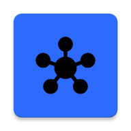

<p align="center">
  
</p>

<h1 align="center">bit Hub</h1>

<p align="center">
  <strong>Высокотехнологичная платформа для дистрибуции и управления Android-приложениями.</strong>
</p>

<p align="center">
  
  
  
  
  
</p>

---

## 🌟 Обзор

**bit Hub** — это современное решение для дистрибуции Android-приложений, построенное на стеке **Jetpack Compose** и **Material 3**. Платформа обеспечивает прямую доставку контента пользователям без посредников, поддерживает фоновую проверку обновлений через **WorkManager** и уведомления о новых версиях. Дизайн выполнен в фирменном стиле **bit Blue (#2C6CFF)** с поддержкой динамических цветов Material You.

---

## ✨ Ключевые возможности

| Возможность | Описание |
|---|---|
| 🚀 **Динамическая витрина** | Обновление списка приложений в реальном времени через Supabase |
| 📥 **Фоновая дистрибуция** | Нативная загрузка APK напрямую из GitHub Releases через системный `DownloadManager` |
| ⚡ **Смарт-инсталлятор** | Автоматический перехват завершённых загрузок и запуск установки |
| 🔔 **Push-уведомления** | Два канала уведомлений: установка приложений и проверка обновлений |
| 🕐 **Фоновая проверка** | Периодический `UpdateWorker` (каждые 2 дня) сверяет версии установленных приложений с базой данных |
| 🎨 **Гибкая тема** | Поддержка светлой, тёмной темы и системного режима через `ThemeMode` |
| 📡 **Умное подключение** | Настройки скачивания: только Wi-Fi или с мобильными данными |
| 🌍 **Локализация** | Поддержка русского и английского языков |
| 🔒 **Безопасная архитектура** | Модульное разделение (Data / UI / Logic) и защищённое хранение ключей через `secrets.properties` |

---

## 🗂 Архитектура приложения

```
com.bit.bithub
├── data/               # Модели данных и репозитории
│   ├── AppModel.kt      # Модель AppItem + mock-данные
│   ├── UpdateModels.kt  # Модели для обновлений
│   ├── UpdateRepository.kt
│   └── UpdateViewModel.kt
├── screens/            # UI-экраны
│   ├── HomeScreen.kt    # Главный экран (карусель, категории, секции)
│   ├── StoreScreen.kt   # Магазин приложений с поиском
│   ├── AppDetailScreen.kt # Детальная страница приложения
│   └── ProfileScreen.kt # Настройки и профиль пользователя
├── components/         # Переиспользуемые Compose-компоненты
│   ├── AppItems.kt
│   ├── DownloadButton.kt
│   ├── SettingsComponents.kt
│   ├── StoreSections.kt
│   └── UpdateBottomSheet.kt
├── worker/             # Фоновые задачи
│   └── UpdateWorker.kt  # Периодическая проверка обновлений
├── settings/           # Управление настройками
│   └── SettingsManager.kt
├── navigation/         # Навигация
├── ui/                 # Темы и стили
├── MainActivity.kt
├── MainViewModel.kt
└── bitHubApplication.kt # Application-класс, инициализация Supabase и WorkManager
```

---

## 🛠 Технологический стек

| Слой | Технологии |
|---|---|
| **UI** | Jetpack Compose, Material 3, Adaptive Navigation Suite |
| **Networking** | Ktor Client, Kotlinx Serialization |
| **Image Loading** | Coil |
| **Backend** | Supabase (Postgrest) |
| **Background Tasks** | WorkManager (CoroutineWorker) |
| **Architecture** | MVVM, Clean Architecture |
| **Notifications** | NotificationCompat, два канала (`INSTALL_CHANNEL`, `UPDATES_CHANNEL`) |
| **Min SDK** | 23 (Android 6.0+) |
| **Target SDK** | 36 (Android 16) |
| **Language** | Kotlin 2.0+ |

---

## Инструкция для разработчиков

### 1. Настройка окружения

Создайте файл `secrets.properties` в корневом каталоге проекта:

```properties
SUPABASE_URL=https://ваш-проект.supabase.co
SUPABASE_KEY=ваш-анонимный-ключ
```

> ⚠️ Файл `secrets.properties` добавлен в `.gitignore` — не передавайте ключи в репозиторий.

### 2. Схема данных (Supabase)

Для развёртывания бэкенда выполните SQL-скрипт:

```sql
create table apps (
  id             bigint primary key generated always as identity,
  title          text not null,
  developer      text,
  rating         float8,
  reviews        text,
  size           text,
  description    text,
  icon_url       text,
  icon_color     text,        -- HEX-код цвета иконки (#RRGGBB)
  is_game        boolean default false,
  download_url   text,        -- прямая ссылка на APK в GitHub Releases
  package_name   text,        -- например, com.bit.stream
  version_code   text,        -- строка версии: "1.2.0"
  version_number int default 0 -- числовой код версии для сравнения
);

-- Публичный доступ на чтение (Row Level Security)
alter table apps enable row level security;
create policy "Allow public read access" on apps for select using (true);
```

### 3. Фоновые задачи (WorkManager)

`UpdateWorker` запускается автоматически каждые **2 дня** при наличии сети. Поведение регулируется через `SettingsManager`:

| Настройка | Описание |
|---|---|
| `periodicUpdateCheck` | Включить/выключить фоновую проверку |
| `updateOverMobileData` | Разрешить проверку через мобильную сеть |
| `downloadWifiOnly` | Скачивать приложения только по Wi-Fi |
| `useMobileData` | Общий доступ к интернету через мобильную сеть |

При обнаружении обновлений пользователь получает уведомление в канале `UPDATES_CHANNEL`.

### 4. Каналы уведомлений

| ID | Назначение |
|---|---|
| `INSTALL_CHANNEL` | Успешная установка приложения |
| `UPDATES_CHANNEL` | Доступны обновления для установленных приложений |

### 5. Стандарты именования

- Бренд: **bit Hub** (регистр «bit» всегда строчный).
- Package: `com.bit.bithub`.
- Entry Point: `BitHubApplication`.

### 6. Сборка и развёртывание

1. Выполните **Sync Project with Gradle Files**.
2. Убедитесь, что `secrets.properties` содержит актуальные ключи Supabase.
3. Проверьте, что `download_url` в базе данных ведёт напрямую на `.apk`-файл.
4. Соберите проект через **Build → Rebuild Project**.
